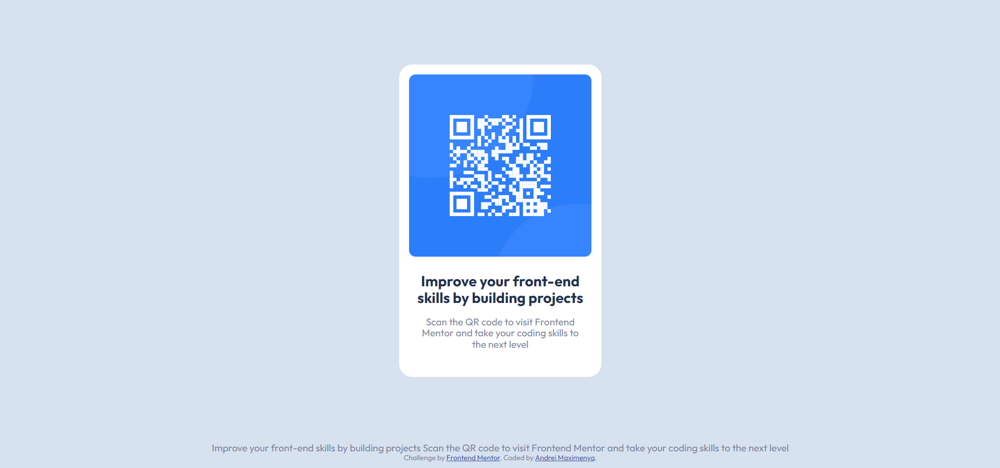

# Frontend Mentor - QR code component solution

This is a solution to the [QR code component challenge on Frontend Mentor](https://www.frontendmentor.io/challenges/qr-code-component-iux_sIO_H). Frontend Mentor challenges help you improve your coding skills by building realistic projects. 

## Table of contents

- [Overview](#overview)
  - [Screenshot](#screenshot)
  - [Links](#links)
- [My process](#my-process)
  - [Built with](#built-with)
  - [What I learned](#what-i-learned)
  - [Useful resourses](#useful-resouces)
- [Author](#author)

## Overview

### Screenshot

### Links

- Solution URL: [Add solution URL here](https://your-solution-url.com)
- Live Site URL: [Add live site URL here](https://your-live-site-url.com)

## My process

### Built with

- Semantic HTML5 markup
- CSS custom properties
- Flexbox

**Note: These are just examples. Delete this note and replace the list above with your own choices**

### What I learned

I learned 3 methods to stick a footer to the bottom.

- Using `margin-top`. But it will make the block big as well.
- Using Flexbox. `flex-grow` and `flex-shring`. Can be used `align-self` as well.
- `position: sticky; top: 100%` . Havent tried yet.

### Useful resouces

[Kevin Powell - Easy sticky footer (YT video)](https://youtu.be/yc2olxLgKLk "Youtube Video")

If you want more help with writing markdown, we'd recommend checking out [The Markdown Guide](https://www.markdownguide.org/) to learn more.

## Author

- Frontend Mentor - [@zang3tsu88](https://www.frontendmentor.io/profile/zang3tsu88)
- Github - [@zang3tsu88](https://github.com/zang3tsu88)
